# Img_Filter_matlab

## Description
This is a project about `Image Filtering` using matlab.

## Original

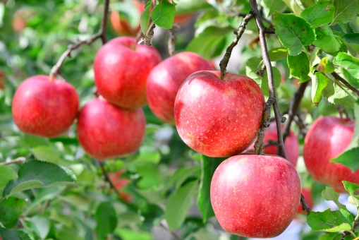

 

## Red

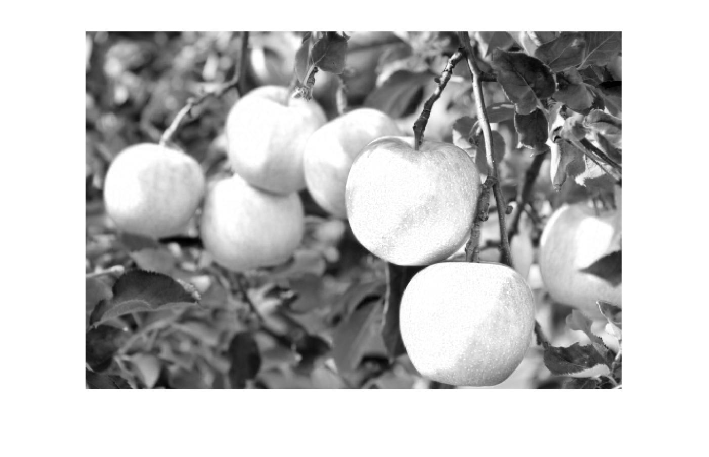

## Green

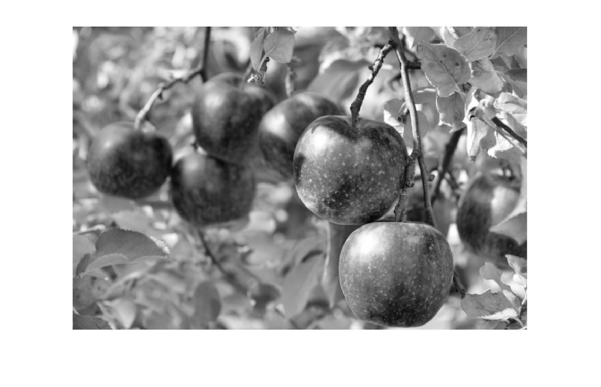

## Blue

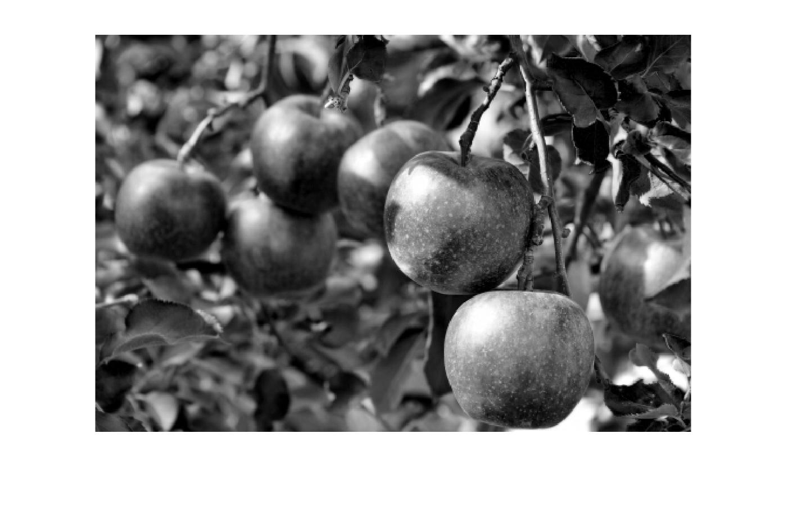

## Grayscale

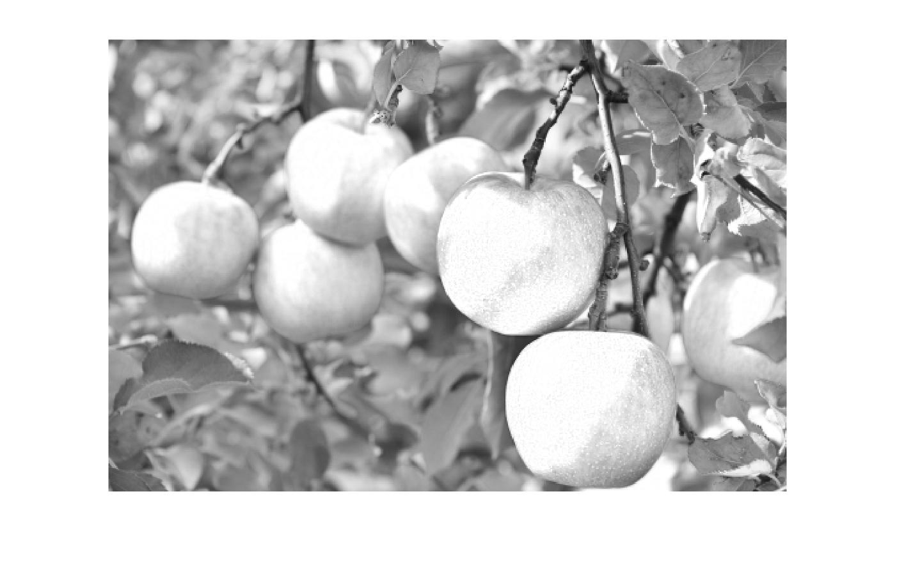

## Zoom

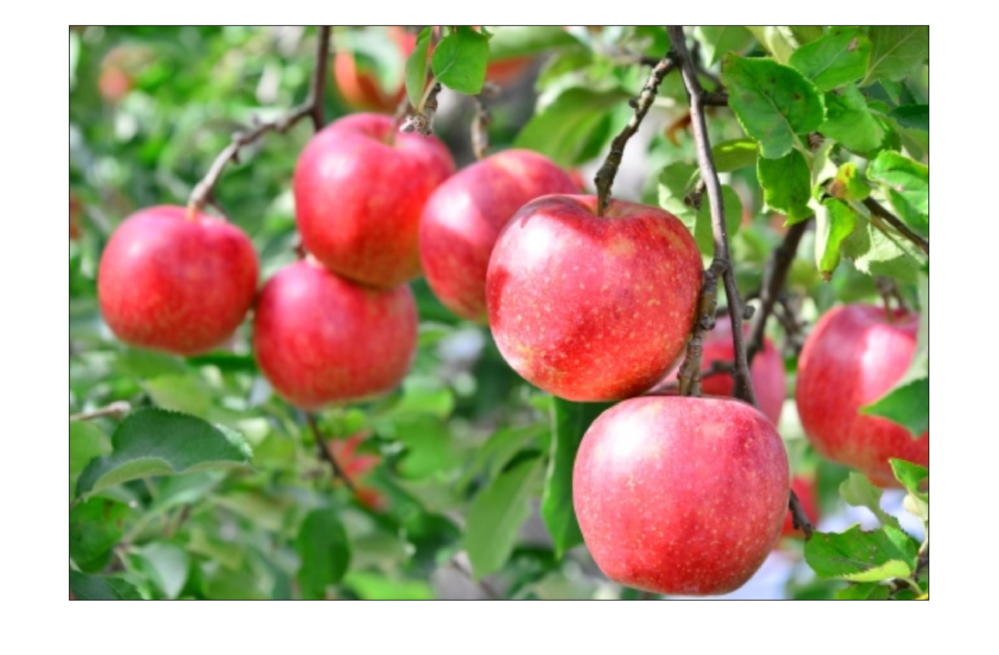

## Rotation

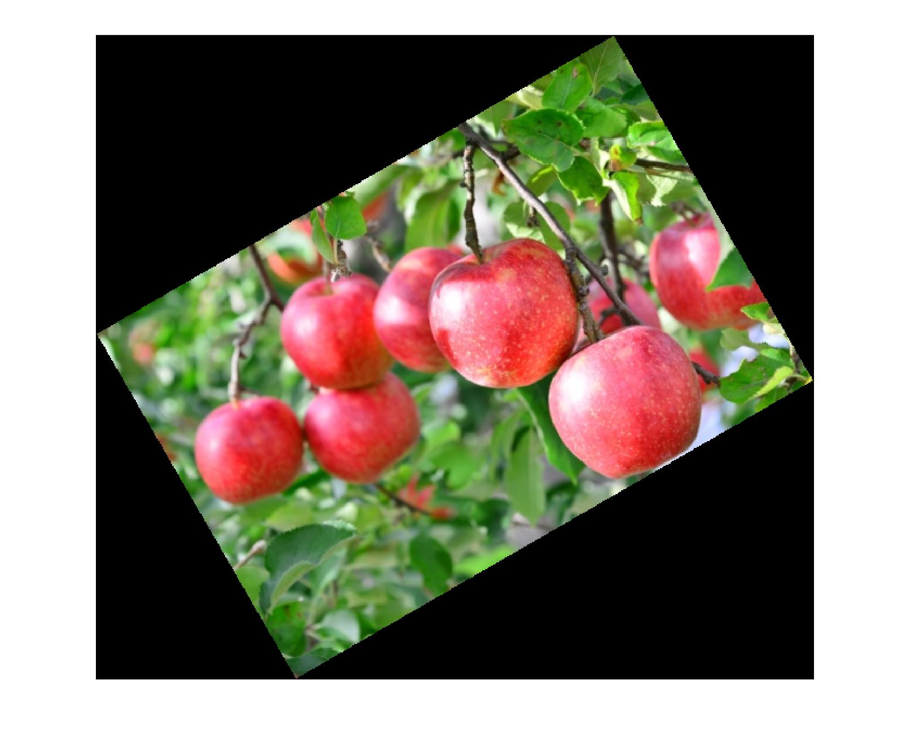

## Shear

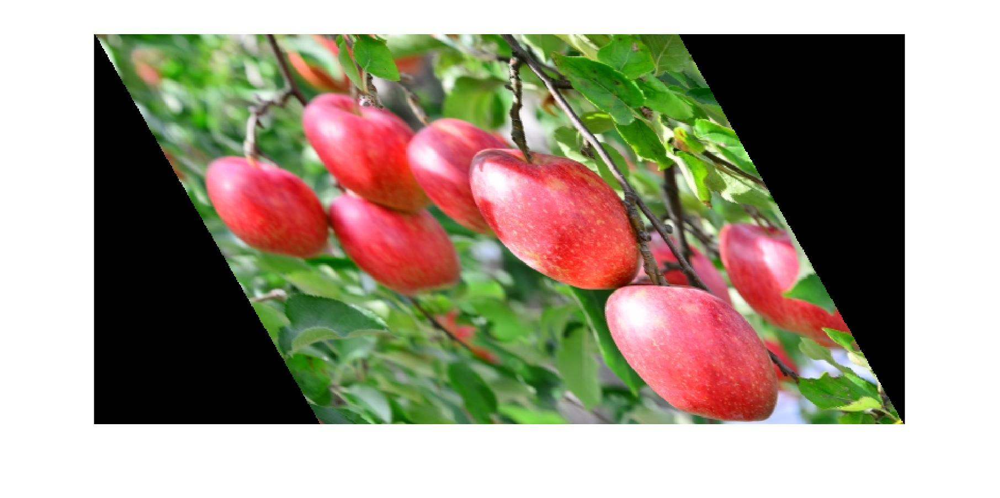

## Original + Noise

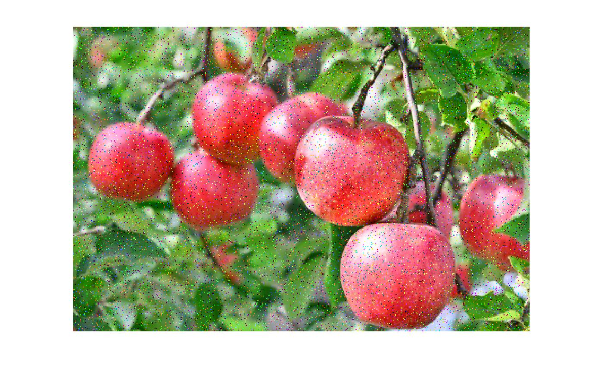

## Filters

### Moving Filter

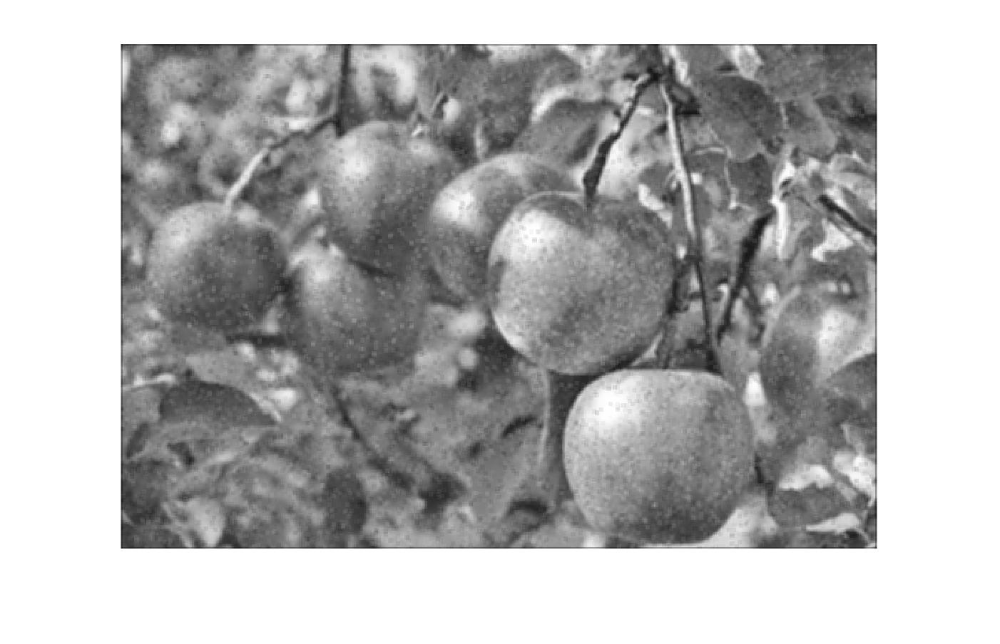

### Median Filter

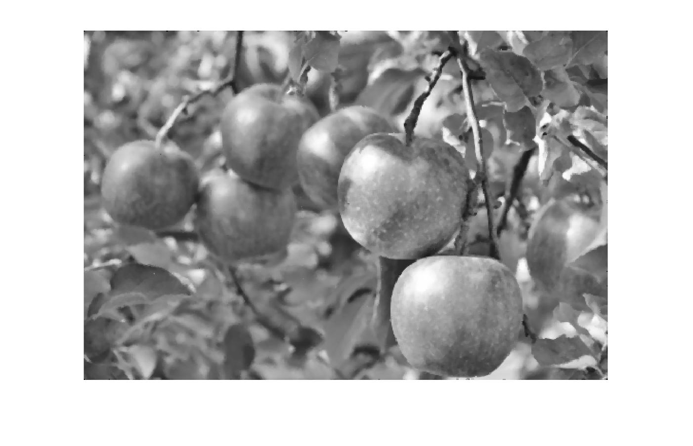

### Weighted Filter

### Sharpening Filter

### Sobel Filter (x / y)

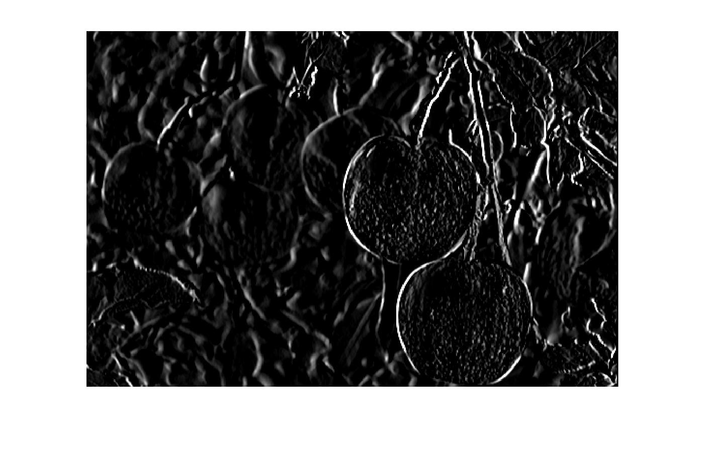

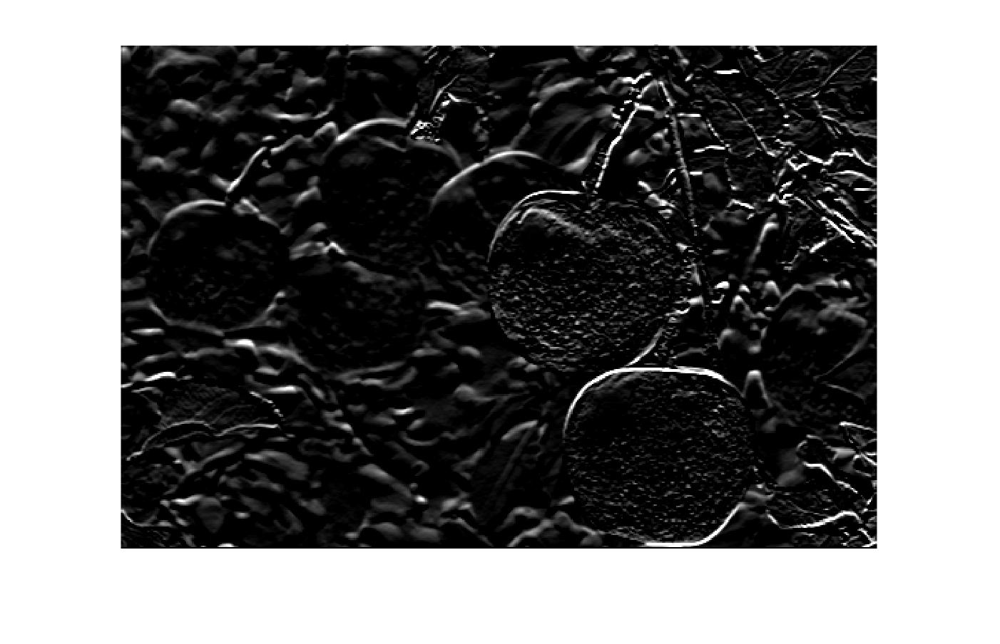

### Prewitt Filter (x / y)

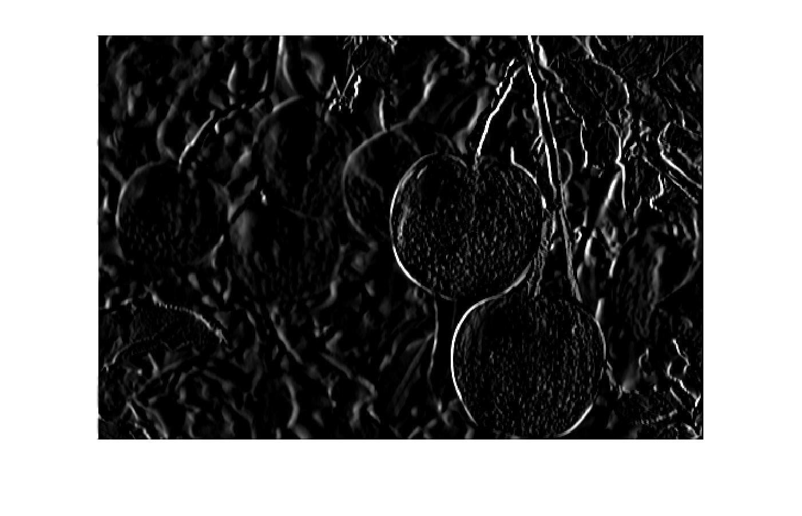

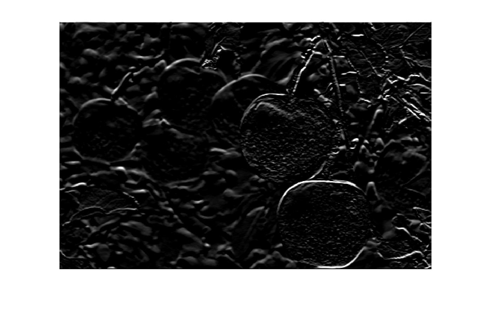

### Laplacian Filter

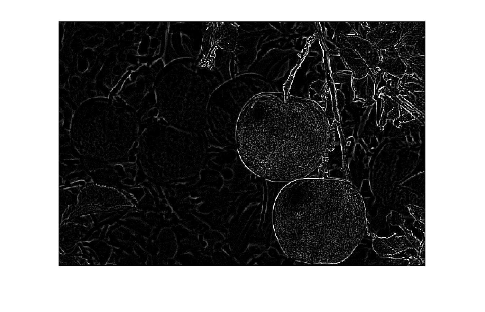

## FFT Filtering

### R5

### R10

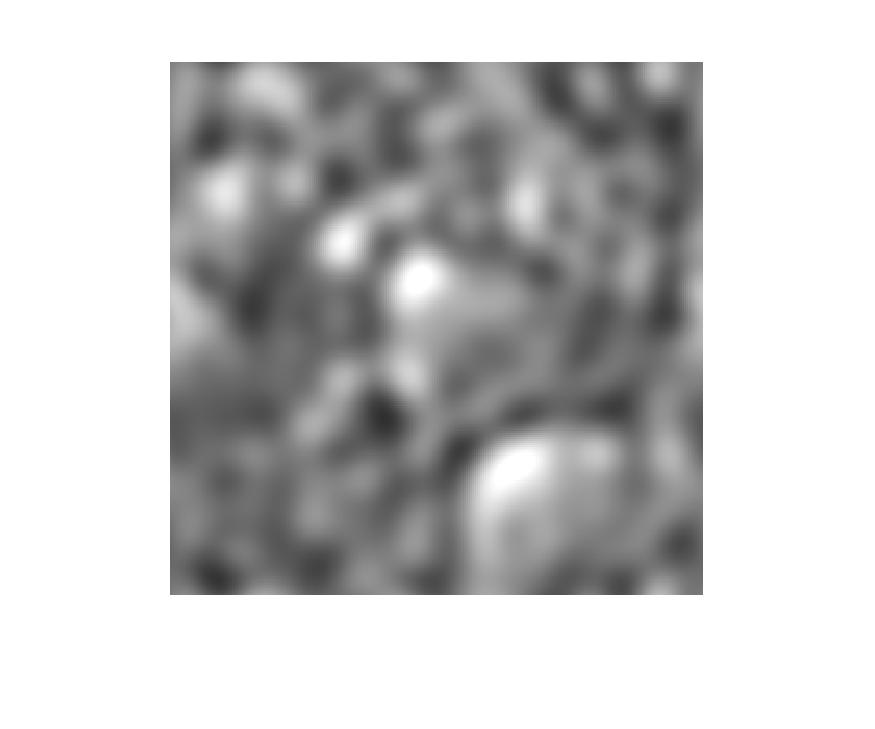

### R50

