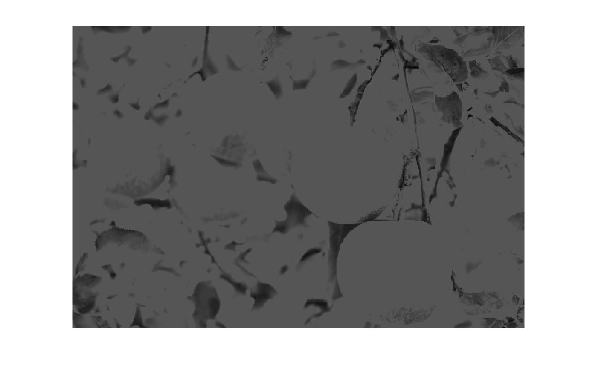

# Img_Filter_matlab

## Description
This is a project about `Image Filtering` using matlab.

## Original

 

## Red

## Green

## Blue

## Grayscale

## Zoom

## Rotation

## Shear

## Original + Noise

## Filters

### Moving Filter

### Median Filter

### Weighted Filter

### Sharpening Filter

### Sobel Filter (x / y)

### Prewitt Filter (x / y)

### Laplacian Filter

## FFT Filtering

### R5

### R10

### R50

